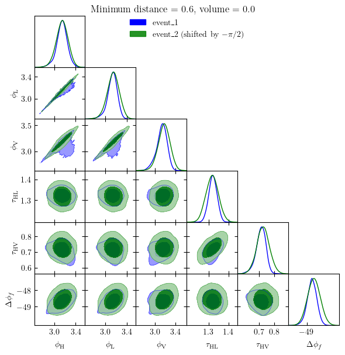

First, we import the two main functions of the package,
:ref:`phazap() <phazap_api>` and :ref:`postprocess_phase() <postprocess_phase_api>`.

.. code:: ipython3

    from phazap import phazap, postprocess_phase

We invoke the function :ref:`postprocess_phase() <postprocess_phase_api>` to compute all the relevant 
phases from the set of posterior samples associated to the first event of the pair 

.. code:: ipython3

    postprocessed_event_1 = postprocess_phase(
        "event_1_PE_samples.json",
        superevent_name="event_1",
        output_dir="./"
    )

.. parsed-literal::

    03:29 phazap INFO    : Detectors online ['H1', 'L1', 'V1']
    03:29 phazap INFO    : Waveform approximant IMRPhenomXPHM
    03:29 bilby INFO    : Waveform generator initiated with
      frequency_domain_source_model: bilby.gw.source.lal_binary_black_hole
      time_domain_source_model: None
      parameter_conversion: bilby.gw.conversion.convert_to_lal_binary_black_hole_parameters
    100%|██████████| 20000/20000 [00:40<00:00, 493.00it/s]
    03:30 phazap INFO    : Assigning None as the label
    03:30 phazap INFO    : Postprocessing completed and saved to ./phases_event_1_fbest_40.0_fhigh_100.0_flow_20.0.hdf5

Then we do the same for the second event of the pair. Notice that the function
:ref:`postprocess_phase() <postprocess_phase_api>` can handle both json and hdf5 files as input.

.. code:: ipython3

    postprocessed_event_2 = postprocess_phase(
        "event_2_PE_samples.hdf5",
        superevent_name="event_2",
        output_dir="./"
    )

.. parsed-literal::

    03:30 phazap INFO    : Detectors online ['H1', 'L1', 'V1']
    03:30 phazap INFO    : Waveform approximant IMRPhenomXPHM
    03:30 bilby INFO    : Waveform generator initiated with
      frequency_domain_source_model: bilby.gw.source.lal_binary_black_hole
      time_domain_source_model: None
      parameter_conversion: bilby.gw.conversion.convert_to_lal_binary_black_hole_parameters
    100%|██████████| 37783/37783 [00:51<00:00, 737.66it/s] 
    03:31 phazap INFO    : Assigning None as the label
    03:31 phazap INFO    : Postprocessing completed and saved to ./phases_event_2_fbest_40.0_fhigh_100.0_flow_20.0.hdf5

Once we have postprocessed both events, we can invoke :ref:`phazap() <phazap_api>` to compute
the :math:`D_J` statistic (the first output) and the associated :math:`p`-value (the fifth output) of the pair with
a specific phase shift (the third output). Refer to the documentation of :ref:`phazap() <phazap_api>` for more details.

.. code:: ipython3

    phazap(postprocessed_event_1, postprocessed_event_2)

.. parsed-literal::

    (0.5972052069812863,
     0.00021390501494614994,
     -1.5707963267948966,
     array([ 11.63033625, 116.76706481,  11.50064831,   0.59720521]),
     0.002853245896191292)

The best-fit phase shift is :math:`-\pi/2`, with 
a distance :math:`D_J \approx 0.597\sigma` and a :math:`p`-value of :math:`0.0002`.
Therefore, according to our analysis, this pair is consistent with being a pair of 
type-I-type-II lensed GW signals.

We can also make a plot visualizing the result with ``phazap.plot_utils.phazap_plot()``

.. code:: ipython3

    from phazap.plot_utils import phazap_plot

.. code:: ipython3

    fig = phazap_plot(
        postprocessed_event_1,
        postprocessed_event_2,
    )

