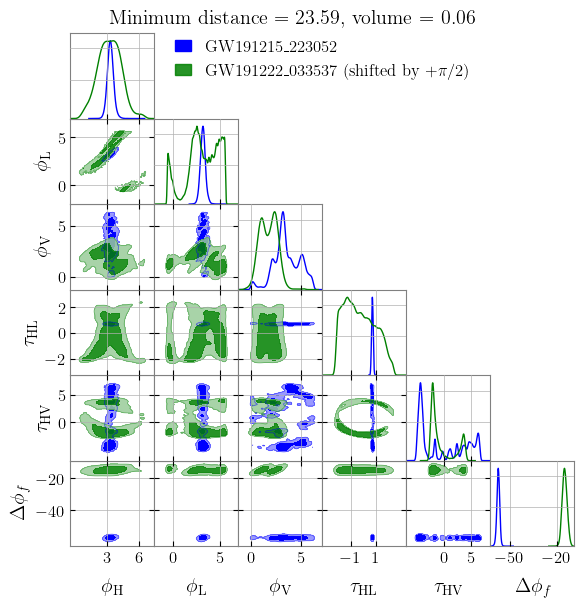

In this example, we will be using **exactly the same code** as above but
using the publicly-available PE results instead. Here we choose
GW191215_223052 and GW191222_033537 as an example.

.. code:: ipython3

    from phazap import phazap, postprocess_phase

.. code:: ipython3

    postprocessed_event_1 = postprocess_phase(
        "IGWN-GWTC3p0-v2-GW191215_223052_PEDataRelease_mixed_cosmo.h5",
        superevent_name="GW191215_223052",
        output_dir="./"
    )

Notice that we are using exactly the same interface as before, but now
the input file is a PESummary metadata file.

.. parsed-literal::

    06:38 phazap INFO    : Detectors online ['H1', 'L1', 'V1']
    06:38 phazap INFO    : Waveform approximant IMRPhenomXPHM
    06:38 bilby INFO    : Waveform generator initiated with
      frequency_domain_source_model: bilby.gw.source.lal_binary_black_hole
      time_domain_source_model: None
      parameter_conversion: bilby.gw.conversion.convert_to_lal_binary_black_hole_parameters
    100%|██████████| 6913/6913 [00:25<00:00, 272.43it/s]
    06:38 phazap INFO    : Assigning None as the label
    06:38 phazap INFO    : Postprocessing completed and saved to ./phases_GW191215_223052_fbest_40.0_fhigh_100.0_flow_20.0.hdf5

.. code:: ipython3

    postprocessed_event_2 = postprocess_phase(
        "IGWN-GWTC3p0-v2-GW191222_033537_PEDataRelease_mixed_cosmo.h5",
        superevent_name="GW191222_033537",
        output_dir="./"
    )

.. parsed-literal::

    06:38 phazap INFO    : Detectors online ['H1', 'L1']
    06:38 phazap INFO    : Waveform approximant IMRPhenomXPHM
    06:38 bilby INFO    : Waveform generator initiated with
      frequency_domain_source_model: bilby.gw.source.lal_binary_black_hole
      time_domain_source_model: None
      parameter_conversion: bilby.gw.conversion.convert_to_lal_binary_black_hole_parameters
    100%|██████████| 26560/26560 [01:24<00:00, 313.89it/s]
    06:40 phazap INFO    : Assigning None as the label
    06:40 phazap INFO    : Postprocessing completed and saved to ./phases_GW191222_033537_fbest_40.0_fhigh_100.0_flow_20.0.hdf5

.. code:: ipython3

    phazap(postprocessed_event_1, postprocessed_event_2)

.. parsed-literal::

    (25.250061987532753,
     0.19916690028571304,
     3.141592653589793,
     array([25.67560006, 25.82643826, 25.25006199, 25.5637582 ]),
     0.999999999999999)

The best-fit phase shift is :math:`+\pi`, with 
a distance :math:`D_J \approx 25.3\sigma` and a :math:`p`-value of basically :math:`1`.
Therefore, according to our analysis, this pair is inconsistent with
being a pair of strongly lensed GW signals of the same source.

Similarly, we can make a plot visualizing the result

.. code:: ipython3

    from phazap.plot_utils import phazap_plot

.. code:: ipython3

    fig = phazap_plot(
        postprocessed_event_1,
        postprocessed_event_2,
    )

